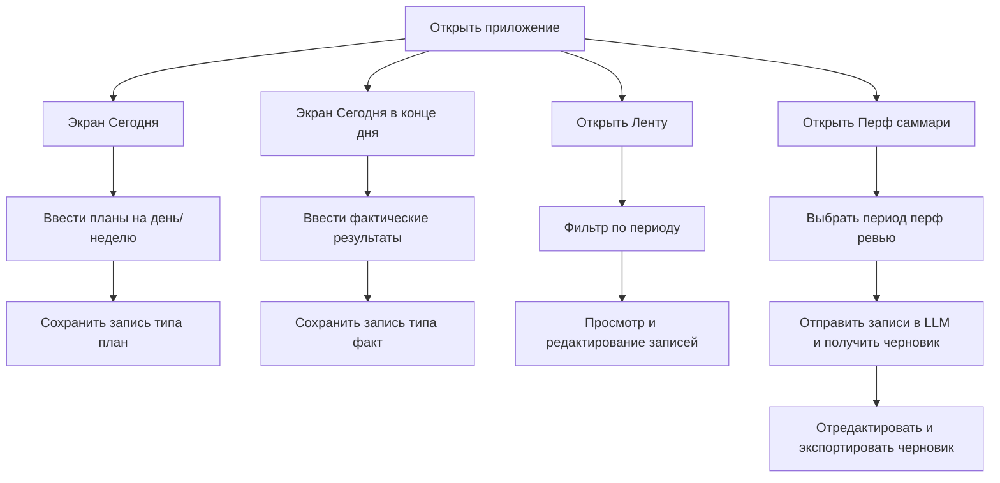

# Perf Assist — продуктовое видение

## 1. Контекст и цель

Perf Assist — self-hosted ассистент для подготовки к performance review. Он помогает:
- регулярно фиксировать планы и фактические результаты работы
- снижать стресс перед перфом за счет накопленной базы проявлений
- генерировать черновики self-review на основе накопленных записей с помощью LLM

Первая версия ориентирована на single-player сценарий: один человек разворачивает сервис локально (docker-compose), использует через веб-интерфейс как «умный блокнот для перфа». Важный принцип — приватность и контроль над данными: все хранится у пользователя, без интеграций с внешними мессенджерами и корпоративными ботами.

## 2. Целевая персона (MVP)

**Персона:** индивидуальный инженер / тимлид / менеджер в продуктовой или технологической компании, у которого есть регулярные перф-циклы (6–12 месяцев).

**Боли:**
- перед перфом сложно вспомнить, что именно делал за период
- много разрозненных артефактов (таски, письма, заметки), нет единой картины
- стресс от необходимости «продавать» свои достижения в сжатые сроки
- лень/сложно вести системный дневник вручную

**Мотивация:**
- хочет честно и полно показать свой вклад
- хочет снизить стресс и сделать подготовку к перфу более механической и предсказуемой
- любит инструменты, которые можно развернуть локально и контролировать данные

## 3. Ключевые сценарии MVP

### 3.1. Ежедневный/периодический лог

**Сценарий «План на период»**
- Пользователь открывает веб-интерфейс.
- Видит вопрос: «Что ты планируешь сегодня/на эту неделю сделать?»
- В свободной форме описывает планы (текстовое поле, можно списком, можно абзацем).
- Сохраняет запись; она привязана к дате и типу «план».

**Сценарий «Факт за период»**
- В конце дня/недели пользователь открывает интерфейс.
- Видит вопрос: «Что получилось из намеченного? Что еще важного произошло?»
- В свободной форме описывает результаты, включая неожиданные задачи, блокеры, достижения.
- Сохраняет запись; она привязана к дате и типу «факт».

**Вариант:** в будущем можно добавить напоминания (локальные нотификации браузера / системные), но в MVP достаточно ручного захода.

### 3.2. Обзор прогресса

**Сценарий «Лента проявлений»**
- Пользователь открывает раздел «Лента».
- Видит хронологический список записей (планы/факты) с датами.
- Может отфильтровать по периоду (неделя, месяц, квартал, кастомный диапазон).
- Может быстро отредактировать или дополнить запись.

### 3.3. Подготовка к перфу

**Сценарий «Сгенерировать черновик перфа»**
- Пользователь выбирает период (например, последние 6 месяцев).
- Нажимает «Сделать черновик self-review».
- LLM получает все записи за период (или их агрегированное представление) и:
  - группирует проявления по темам (impact, ownership, collaboration, leadership и т.п. — настраиваемо позже)
  - формирует связный текст черновика self-review
  - может предложить список bullet-поинтов «ключевые достижения»
- Пользователь видит черновик, может его редактировать и экспортировать (копировать в буфер, сохранить как .md/.txt).

### 3.4. Работа с тегами и фокусами (возможное расширение MVP)

**Сценарий «Отметить важное»**
- При создании записи пользователь может добавить теги (например: `impact`, `team`, `tech-debt`, `mentoring`).
- В будущем это позволит делать более точные саммари по конкретным компетенциям.

На самый первый инкремент можно оставить теги опциональными или даже скрытыми, а LLM может предлагать теги автоматически.

## 4. Ограничения и принципы MVP

1. **Self-hosted only**
   - Разворачивание через docker-compose.
   - Веб-интерфейс доступен по localhost.
   - Нет внешних SaaS-зависимостей, кроме LLM-провайдера (можно предусмотреть локальную модель позже).

2. **Приватность и безопасность**
   - Данные хранятся в локальной БД (например, SQLite/Postgres в контейнере).
   - Нет интеграций с мессенджерами, корпоративными ботами, Jira, календарем в MVP.
   - Вся логика построена так, чтобы пользователь мог легко сделать бэкап/экспорт своих данных.

3. **Простота интерфейса**
   - Минимум экранов: «Сегодня», «Лента», «Перф-саммари».
   - Фокус на текстовом вводе и чтении, без сложных дашбордов.

4. **LLM как помощник, не как источник правды**
   - LLM генерирует черновики и подсказки, но пользователь всегда может отредактировать.
   - Важно сохранять исходные записи как первичный источник.

## 5. Границы MVP и отложенные фичи

**Входит в MVP:**
- Создание и хранение текстовых записей «план» и «факт» с привязкой к дате.
- Простая лента записей с фильтром по периоду.
- Генерация черновика self-review за выбранный период с помощью LLM.
- Базовая конфигурация перф-периода (например, 6 или 12 месяцев) для удобного выбора диапазона.
- Self-hosted разворачивание через docker-compose.

**Не входит в MVP (но держим в голове):**
- Интеграции с календарем, Jira, GitHub и др.
- Командные фичи (общие пространства, шаринг, менеджерский обзор).
- Сложная система напоминаний и нотификаций.
- Мобильные приложения и телеграм-боты.
- Гибкая настройка фреймворков перф-оценки (компетенции, грейды и т.п.).

## 6. Пользовательские флоу (high-level)



## 7. Черновой промпт-контекст для будущих запросов к моделям

Ниже черновой системный контекст, который можно будет дорабатывать. Он нужен, чтобы последующие запросы к моделям были в одном вайбе.

```text
Ты выступаешь как ассистент для подготовки к performance review. У пользователя есть база текстовых записей о его работе: планы и факты за разные дни и недели. Каждая запись содержит свободный текст, иногда с тегами.

Твои задачи:
- помогать пользователю осмыслять свои записи: находить паттерны, достижения, риски
- собирать из множества мелких проявлений более крупные истории для перф ревью
- формировать структурированные черновики self-review за выбранный период

Принципы работы:
- опирайся на конкретные факты из записей пользователя, не выдумывай достижения
- помогай группировать проявления по темам: влияние на продукт, командное взаимодействие, техническая глубина, лидерство, процессы
- пиши в тоне уважительного, но честного коллеги, который помогает сформулировать мысли
- всегда оставляй пространство для правок: предлагай формулировки как черновик, а не финальный текст

Форматы ответов:
- краткие bullet-поинты с достижениями
- развернутые абзацы для self-review
- предложения по улучшению формулировок и структурированию
```
