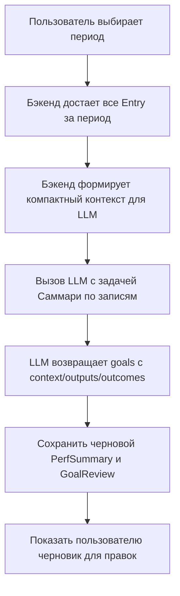
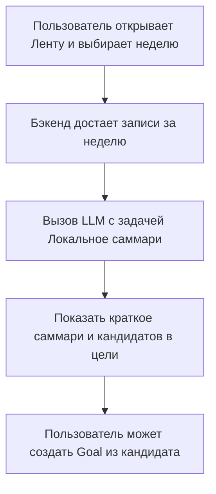

# Данные и LLM-дизайн для Perf Assist

Этот документ фиксирует, какие данные мы храним, как они связаны с перф-процессом и как будем использовать LLM для генерации перф-саммари.

## 1. Ментальная модель перфа

Твой текущий формат self-review:
- проявления объединяются в **цели / проекты**
- для каждой цели описывается:
  - **Context** — почему вообще делали этот проект, какой был фон, какие проблемы/возможности
  - **Outputs** — что конкретно было сделано (действия, артефакты)
  - **Outcomes** — чего достигли по итогу (изменения, эффекты, метрики)

Важно: роль пользователя влияет на акценты
- **Инженер**
  - Outputs: пулреквесты, фичи, фиксы, техдолг, инфраструктура
  - Outcomes: инженерные эффекты (надежность, скорость, качество, DX), иногда продуктовые
- **Тимлид / менеджер**
  - Outputs: процессы, договоренности, таблички, синки, фасилитация, решения
  - Outcomes: продуктовые и командные результаты (метрики, скорость команды, качество, вовлеченность)

Perf Assist должен помогать:
- из сырых ежедневных записей (планы/факты) собирать **кандидатные цели/проекты**
- для каждой цели вытаскивать из записей контекст, outputs и outcomes
- адаптировать формулировки под роль пользователя (инженер / тимлид)

## 2. Модель данных (MVP)

### 2.1. Пользователь

```text
User
- id
- name (опционально)
- role: engineer | lead | manager | mixed (для MVP можно сделать просто text role_hint)
- perf_cycle_length_months (например, 6 или 12)
- created_at
```

### 2.2. Ежедневные записи (Events / Entries)

Базовая сущность — текстовая запись за период.

```text
Entry
- id
- user_id
- date (день, к которому относится запись)
- type: plan | fact
- raw_text (оригинальный текст пользователя)
- llm_enriched (JSON с доп. структурой от LLM, см. ниже)
- created_at
- updated_at
```

`llm_enriched` (черновая структура):

```json
{
  "detected_projects": [
    {
      "name": "Migration to new logging system",
      "confidence": 0.82
    }
  ],
  "candidate_outputs": [
    "Implemented feature flag for new logging pipeline",
    "Refactored log aggregation job"
  ],
  "candidate_outcomes": [
    "Reduced log processing latency",
    "Improved observability for oncall incidents"
  ],
  "tags": ["observability", "reliability", "tech-debt"]
}
```

На MVP можно начать без автоматического обогащения и добавить его вторым шагом.

### 2.3. Цели / проекты (Perf Goals)

Цели могут быть явными (пользователь сам создал) или выведенными из записей (LLM-подсказки).

```text
Goal
- id
- user_id
- title (человеческое название проекта/цели)
- description (черновое описание, можно использовать как контекст)
- status: draft | active | archived
- created_at
- updated_at
```

Связь записей с целями:

```text
GoalEntryLink
- id
- goal_id
- entry_id
- relevance_score (0..1, насколько запись относится к цели)
- note (опциональный комментарий пользователя)
```

### 2.4. Структура перф-описания по цели

Для каждой цели нам нужно хранить (и/или генерировать) три блока:

```text
GoalReview
- id
- goal_id
- period_start
- period_end
- context_text (контекст проекта)
- outputs_text (что делали)
- outcomes_text (чего достигли)
- role_view: engineer | lead | manager | generic
- generated_by_llm (bool)
- created_at
- updated_at
```

На MVP можно не делать отдельную таблицу, а хранить это как JSON в `Goal`, но явная модель поможет дальше.

### 2.5. Перф-саммари за период

```text
PerfSummary
- id
- user_id
- period_start
- period_end
- raw_goals (список goal_id, вошедших в саммари)
- summary_text (общий нарратив)
- bullets (JSON: список ключевых пунктов)
- created_at
- updated_at
```

## 3. LLM-задачи и промпты (MVP)

### 3.1. Задача 1: Саммари по записям за период

**Цель:** по выбранному периоду собрать черновик self-review в формате целей с контекстом, outputs и outcomes.

Вход для LLM:
- системный промпт (вайб ассистента)
- роль пользователя (engineer / lead / manager)
- период (start, end)
- список записей за период:
  - дата
  - тип (plan/fact)
  - текст

Черновой системный промпт:

```text
Ты помогаешь пользователю подготовиться к performance review.
У тебя есть список его текстовых записей за период: планы и факты по дням и неделям.
Твоя задача — сгруппировать эти проявления в несколько целей или проектов и для каждой цели описать:
- Context: почему эта цель появилась, какой был фон, какие проблемы или возможности решались
- Outputs: что конкретно делал пользователь, какие артефакты создавал, какие действия предпринимал
- Outcomes: каких результатов это помогло достичь

Учитывай роль пользователя:
- Если роль ближе к инженеру, делай акцент в Outputs на инженерных действиях (код, архитектура, инфраструктура, техдолг), а в Outcomes — на инженерных эффектах (надежность, производительность, качество, скорость разработки).
- Если роль ближе к тимлиду или менеджеру, делай акцент в Outputs на процессах, коммуникациях, принятии решений, а в Outcomes — на продуктовых и командных результатах (метрики, скорость команды, качество поставки, вовлеченность).

Правила:
- Не выдумывай проекты, опирайся на факты из записей, но можешь объединять близкие задачи в одну цель.
- Не придумывай метрики, если их нет в тексте, но можешь предлагать аккуратные формулировки вроде "улучшили стабильность" или "снизили количество инцидентов" если это явно следует из записей.
- Пиши в формате, удобном для вставки в self-review.

Формат ответа (JSON):
{
  "goals": [
    {
      "title": "Краткое название цели",
      "context": "1-3 абзаца контекста",
      "outputs": ["bullet-поинты с действиями"],
      "outcomes": ["bullet-поинты с результатами"]
    }
  ]
}
```

### 3.2. Задача 2: Локальное саммари по дню/неделе

**Цель:** помочь пользователю быстро понять, что было сделано за короткий период.

Вход:
- список записей за день/неделю

Выход:
- краткое саммари (3–7 bullet-поинтов)
- опционально: список кандидатов в цели/проекты

Черновой промпт:

```text
У тебя есть несколько текстовых записей пользователя за короткий период (день или неделя).
Сделай краткое саммари в виде 3-7 bullet-поинтов, фокусируясь на том, что пользователь реально сделал и какие шаги приблизили его к результатам.
Если видишь повторяющуюся тему или проект, предложи 1-3 возможных названия целей/проектов.
Формат ответа (JSON):
{
  "summary": ["bullet 1", "bullet 2"],
  "candidate_goals": ["Название цели 1", "Название цели 2"]
}
```

### 3.3. Задача 3: Редактирование и полировка формулировок

**Цель:** помочь пользователю превратить черновые формулировки в более аккуратный текст для перфа.

Вход:
- роль пользователя
- черновой текст (context/outputs/outcomes)

Выход:
- отредактированный текст в том же формате, но более ясный и структурированный

Черновой промпт:

```text
Пользователь готовит текст для performance review.
У тебя есть черновые формулировки контекста, outputs и outcomes по одной цели.
Перепиши их так, чтобы текст был:
- ясным и структурированным
- без воды, но с сохранением сути
- в тоне профессионального, но не пафосного self-review

Не добавляй фактов, которых нет в тексте. Можно слегка усиливать формулировки, но без преувеличений.
Верни текст в том же структурном формате: Context, Outputs (список bullet-поинтов), Outcomes (список bullet-поинтов).
```

## 4. Как это ляжет в продуктовые флоу

### 4.1. Пользовательский флоу «Сделать перф-саммари за период»



### 4.2. Пользовательский флоу «Быстрое саммари недели»



## 5. Черновой промпт-контекст для дальнейшего вайбкодинга

Этот блок можно использовать как базовый системный промпт для следующих итераций проектирования и реализации.

```text
Ты помогаешь спроектировать и реализовать self-hosted сервис Perf Assist для подготовки к performance review.

Ключевые идеи продукта:
- Пользователь регулярно записывает планы и факты по своей работе в свободной форме.
- Сервис хранит эти записи локально и помогает из них собирать цели/проекты с контекстом, outputs и outcomes.
- Формат перфа: несколько целей, для каждой описаны Context, Outputs, Outcomes.
- Роль пользователя (инженер или тимлид/менеджер) влияет на акценты в формулировках.

Требования:
- Single-player, self-hosted, разворачивание через docker-compose.
- Веб-интерфейс как умный блокнот: экраны Сегодня, Лента, Перф-саммари.
- Приватность: все данные хранятся локально, без интеграций с мессенджерами и корпоративными системами в MVP.

Твоя задача как модели:
- помогать проектировать схему данных, API, промпты и UX так, чтобы было удобно собирать перф из ежедневных проявлений
- предлагать структуры JSON для обмена между фронтом, бэком и LLM
- держать в голове формат Context / Outputs / Outcomes и роль пользователя
```
