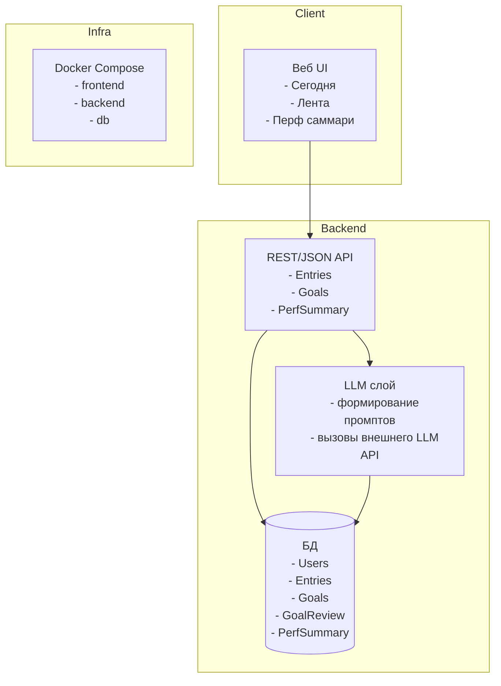

# Архитектура и промпт-контекст Perf Assist (MVP)

## 1. High-level архитектура

MVP ориентирован на single-player, self-hosted сценарий с разворачиванием через docker-compose.



### 1.1. Компоненты

- Frontend
  - Простой SPA/SSR веб-клиент.
  - Экраны: Сегодня, Лента, Перф-саммари.
  - Общение с бэкендом по REST/JSON.

- Backend
  - HTTP API для CRUD по Entries, Goals, PerfSummary.
  - LLMProxy-слой внутри бэкенда: формирует промпты, вызывает LLM-провайдера, сохраняет результаты.

- Database
  - Реляционная БД (для MVP можно SQLite, позже Postgres).

- LLM-провайдер
  - Внешний API (например, OpenAI/Anthropic/локальная модель), конфигурируется через env.

- Docker Compose
  - Сервисы: frontend, backend, db.

## 2. Основные API-флоу

### 2.1. Создание записи (план/факт)


### 2.2. Получение ленты записей


### 2.3. Генерация перф-саммари за период


## 3. Черновой формат API (JSON)

### 3.1. Entry

```json
{
  "id": "uuid",
  "date": "2026-01-30",
  "type": "plan",
  "text": "Сегодня хочу...",
  "created_at": "2026-01-30T10:00:00Z"
}
```

### 3.2. PerfSummary ответ

```json
{
  "id": "uuid",
  "period_start": "2025-07-01",
  "period_end": "2025-12-31",
  "summary_text": "Общий нарратив...",
  "goals": [
    {
      "id": "goal-uuid",
      "title": "Улучшение стабильности логирования",
      "context": "...",
      "outputs": ["..."],
      "outcomes": ["..."]
    }
  ]
}
```

## 4. Промпт-контекст для реализации (вайбкодинг)

Этот блок можно использовать как системный промпт для следующих запросов к моделям при разработке Perf Assist.

```text
Ты помогаешь разрабатывать self-hosted сервис Perf Assist для подготовки к performance review.

Текущая архитектура:
- Веб-клиент (SPA/SSR) с экранами Сегодня, Лента, Перф-саммари.
- Бэкенд с REST/JSON API для работы с сущностями User, Entry, Goal, GoalReview, PerfSummary.
- LLM-слой внутри бэкенда, который формирует промпты и вызывает внешнего LLM-провайдера.
- Реляционная БД (SQLite/Postgres) для хранения всех данных.
- Разворачивание через docker-compose (frontend, backend, db).

Ключевая продуктовая логика:
- Пользователь регулярно создает текстовые записи типа план и факт, привязанные к дате.
- Из этих записей сервис помогает собирать цели/проекты для перфа.
- Формат перфа: для каждой цели описаны Context, Outputs, Outcomes.
- Роль пользователя (инженер или тимлид/менеджер) влияет на акценты в формулировках.

Твои задачи как модели в дальнейшем:
- проектировать и уточнять схему данных и API (в JSON-формате)
- помогать писать бэкенд и фронтенд код (эндпоинты, компоненты, стейт)
- разрабатывать и улучшать промпты для LLM-задач (саммари периода, саммари недели, полировка формулировок)
- предлагать эволюцию архитектуры по мере роста продукта, сохраняя простоту self-hosted сценария

Всегда опирайся на следующие принципы:
- Приватность: все данные локальны, никаких внешних интеграций в MVP.
- Простота: минимальный набор экранов и сущностей, без избыточной сложности.
- Перф-формат: Context / Outputs / Outcomes как основная рамка.
- Роль-зависимые формулировки: инженерный vs менеджерский взгляд.
```
